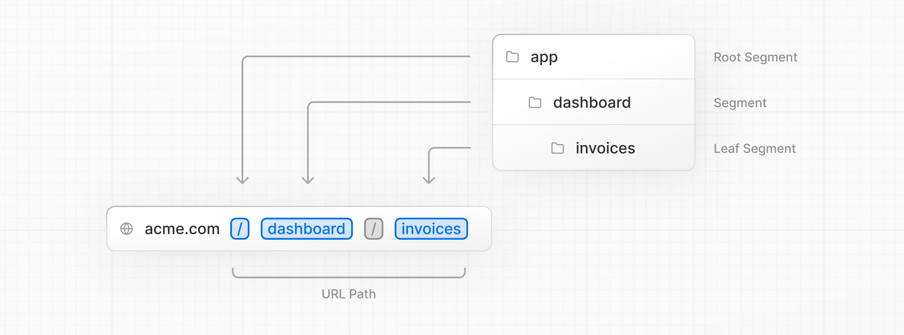
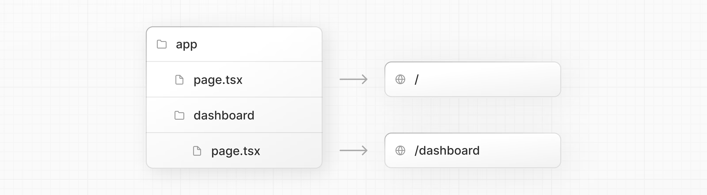
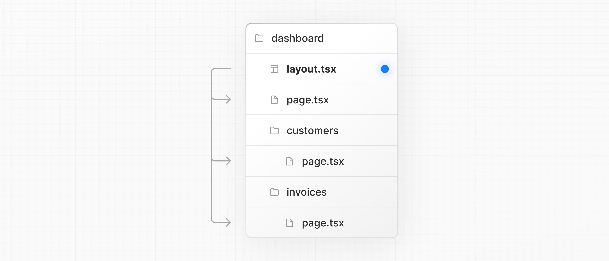
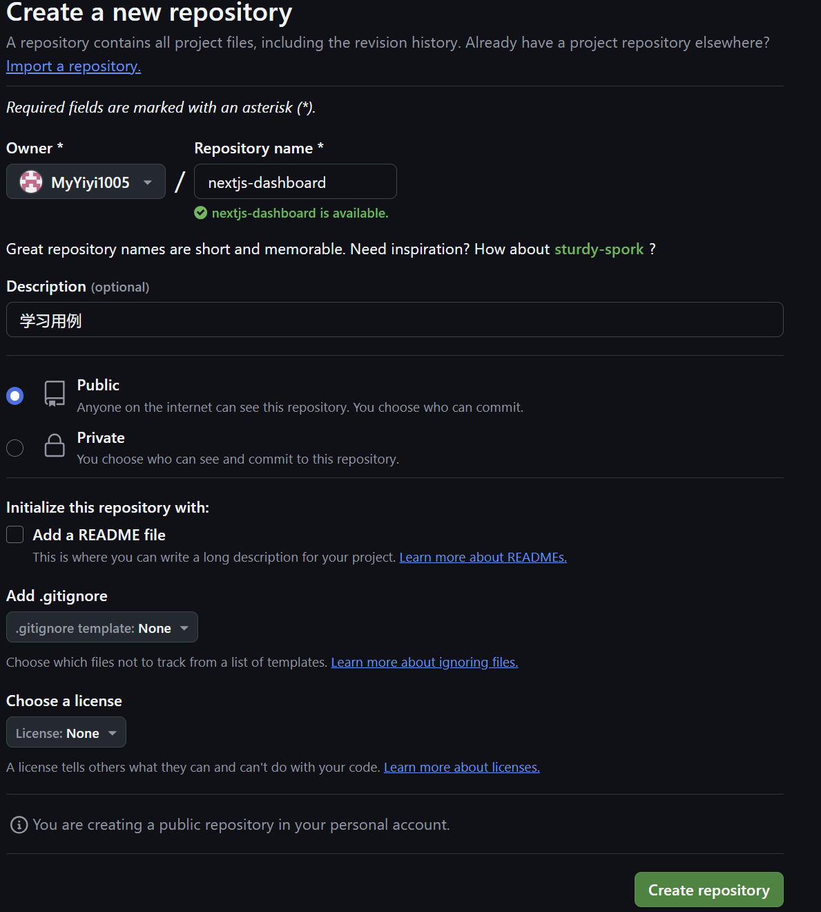
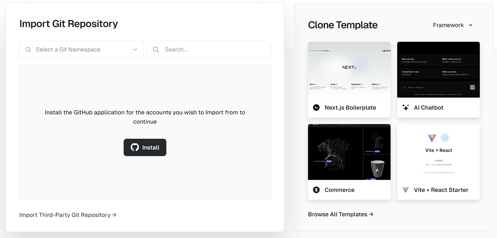
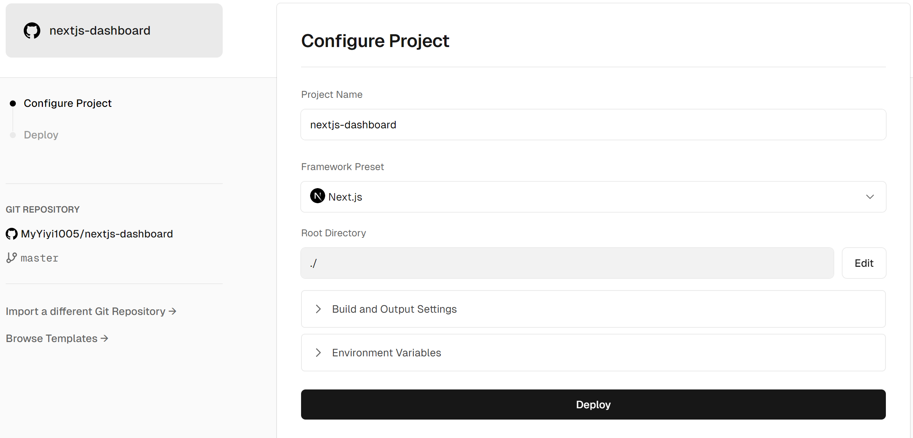

## Next.js App Router Course - Starter

This is the starter template for the Next.js App Router Course. It contains the starting code for the dashboard application.

For more information, see the [course curriculum](https://nextjs.org/learn) on the Next.js Website.

参考：https://nextjs.org/learn?utm_source=next-site&amp;utm_medium=homepage-cta&amp;utm_campaign=home

## 文件结构

**`/app`** ：包含应用程序的所有路由、组件和逻辑，主要工作的地方。

**`/app/lib`** ：包含应用程序中使用的函数，例如可重用的实用程序函数和数据获取函数。

**`/app/ui`** ：包含应用程序的所有 UI 组件，例如卡片、表格和表单。为了节省时间，我们为您预先设置了这些组件的样式。

**`/public`** ：包含应用程序的所有静态资源，例如图像。

**Config Files** ：您还会注意到应用程序根目录中的配置文件，例如 `next.config.js`。这些文件中的大多数都是在使用 `create-next-app` 启动新项目时创建和预配置的。无需修改它们。

## 占位符

在构建用户界面时，拥有一些占位符数据会有所帮助。如果数据库或 API 尚不可用，您可以：

* 使用 JSON 格式的占位符数据或作为 JavaScript 对象。
* 使用第三方服务，如 [mockAPI](https://mockapi.io/)。

对于这个项目，我们在 `app/lib/placeholder-data.ts` 中提供了一些占位符数据。文件中的每个 JavaScript 对象都表示数据库中的一个表。例如，对于 invoices 表：/app/lib/placeholder-data.ts

## TypeScript

您可能还会注意到大多数文件都有 `.ts` 或 `.tsx` 后缀。这是因为该项目是用 TypeScript 编写的。我们想创建一门反映现代 Web 环境的课程。

查看 `/app/lib/definitions.ts` 文件。在这里，我们手动定义将从数据库返回的类型。例如，invoices 表具有以下类型：

```typescript
export type Invoice = {
  id: string;
  customer_id: string;
  amount: number;
  date: string;
  // In TypeScript, this is called a string union type.
  // It means that the "status" property can only be one of the two strings: 'pending' or 'paid'.
  status: 'pending' | 'paid';
};
```

通过使用 TypeScript，您可以确保不会意外地将错误的数据格式传递给组件或数据库，例如将 `字符串`而不是 `数字`传递给发票 `金额`。

## 运行开发服务器

运行 `pnpm i` 以安装项目的包。

然后是 `pnpm dev` 来启动开发服务器。

### 错误：pnpm 无法加载文件解决

1. 打开 PowerShell 以管理员身份运行。
2. 输入以下命令来查看当前的执行策略：

   Get-ExecutionPolicy
3. 如果执行策略为 `Restricted`，则需要更改它。输入以下命令来更改执行策略：

   **Set-ExecutionPolicy** RemoteSigned
4. 系统会提示确认更改执行策略，输入 `Y` 来确认。

## 全局样式

您可以在应用程序的任何组件中导入 `global.css`，但通常最好将其添加到顶级组件中。

通过导航到 `/app/layout.tsx` 并导入 `global.css` 文件。

```typescript
import '@/app/ui/global.css';  # 手动添加
 
export default function RootLayout({
  children,
}: {
  children: React.ReactNode;
}) {
  return (
    <html lang="en">
      <body>{children}</body>
    </html>
  );
}
```

在开发服务器仍在运行的情况下，保存您的更改并在浏览器中预览它们。看一下 `global.css` 内部，你会注意到一些 `@tailwind` 指令。

## Tailwind

[Tailwind](https://tailwindcss.com/) 是一个 CSS 框架，它允许您直接在 TSX 标记中快速编写[实用程序类](https://tailwindcss.com/docs/utility-first)，从而加快开发过程。

尽管 CSS 样式是全局共享的，但每个类都单独应用于每个元素。这意味着，如果您添加或删除元素，则不必担心维护单独的样式表、样式冲突或 CSS 包的大小会随着应用程序的扩展而增加。

## 使用 clsx library 切换类名

在某些情况下，你可能需要根据状态或其他条件有条件地设置元素的样式。

[`CLSX`](https://www.npmjs.com/package/clsx) 是一个允许您轻松切换类名的库。我们建议查看[文档](https://github.com/lukeed/clsx)了解更多详细信息，但以下是基本用法：

* 假设您要创建一个接受 `status` 的 `InvoiceStatus` 组件。状态可以是 `“待处理”`或 `“已付款`”。
* 如果是 `'paid'` 的，则您希望颜色为绿色。 如果它是 `'pending'`，则您希望颜色为灰色。

您可以使用 `clsx` 有条件地应用类，如下所示：

```typescript
import clsx from 'clsx';
 
export default function InvoiceStatus({ status }: { status: string }) {
  return (
    <span
      className={clsx(
        'inline-flex items-center rounded-full px-2 py-1 text-sm',
        {
          'bg-gray-100 text-gray-500': status === 'pending',
          'bg-green-500 text-white': status === 'paid',
        },
      )}
    >
    // ...
)}
```

## 优化字体图像

字体在网站设计中起着重要作用，但是如果需要获取和加载字体文件，则在项目中使用自定义字体可能会影响性能。

[Cumulative Layout Shift](https://vercel.com/blog/how-core-web-vitals-affect-seo) 是 Google 用来评估网站性能和用户体验的指标。对于字体，当浏览器最初以回退字体或系统字体呈现文本，然后在加载后将其换成自定义字体时，就会发生布局偏移。这种交换可能会导致文本大小、间距或布局发生变化，从而移动周围的元素。

Next.js 会在您使用 `next/font` 模块时自动优化应用程序中的字体。它在构建时下载字体文件，并将其与其他静态资源一起托管。这意味着，当用户访问您的应用程序时，没有其他网络请求字体，这会影响性能。

### 添加主字体

让我们将自定义 Google 字体添加到您的应用程序中，看看它是如何工作的！

在 `/app/ui` 文件夹中，创建一个名为 `fonts.ts` 的新文件。您将使用此文件来保留将在整个应用程序中使用的字体。

从 `next/font/google` 模块导入 `Inter` 字体 - 这将是您的主要字体。然后，指定要加载的[子集](https://fonts.google.com/knowledge/glossary/subsetting)。在本例中，`'latin'`：

```typescript
import { Inter } from 'next/font/google';
 
export const inter = Inter({ subsets: ['latin'] });
```

最后，将字体添加到 `/app/layout.tsx` 中的 `<body>` 元素中：

```typescript
import '@/app/ui/global.css';
import { inter } from '@/app/ui/fonts'; # 新增加
 
export default function RootLayout({
  children,
}: {
  children: React.ReactNode;
}) {
  return (
    <html lang="en">
      <body className={`${inter.className} antialiased`}>{children}</body> 
    </html>
  );
}
```

通过将 `Inter` 添加到 `<body>` 元素中，该字体将应用于整个应用程序。在这里，您还将添加 Tailwind [`antialiased`](https://tailwindcss.com/docs/font-smoothing) 类，该类可平滑字体。没有必要使用这个类，但它增加了一个很好的功能。

### 添加辅助字体

您还可以将字体添加到应用程序的特定元素中。

在 `fonts.ts` 文件中，导入名为 `Lusitana` 的辅助字体，并将其传递给 `/app/page.tsx` 文件中的 `<p>` 元素。除了像以前一样指定子集之外，您还需要指定字体 **粗细** 。

## 添加主图

Next.js 可以在顶级 [`/public`](https://nextjs.org/docs/app/building-your-application/optimizing/static-assets) 文件夹下提供 **静态资源** ，如图像。可以在应用程序中引用 `/public` 中的文件。

使用常规 HTML，您可以按如下方式添加图像：

```html

```

但是，这意味着您必须手动：

* 确保您的图像在不同屏幕尺寸上具有响应性。
* 为不同的设备指定图像大小。
* 防止在图像加载时发生布局偏移。
* 延迟加载用户视区之外的图像。

图像优化是 Web 开发中的一个大主题，它本身可以被视为一个专业。您可以使用 `next/image` 组件自动优化图像，而不是手动实施这些优化

### `<Image>` 组件

`<Image>` 组件是 HTML `` 标记的扩展，并带有自动图像优化功能，例如：

* 防止在加载图像时自动移动布局。
* 调整图像大小以避免将大型图像发送到具有较小视区的设备。
* 默认情况下延迟加载图像（图像在进入视区时加载）。
* 在浏览器支持的情况下，以现代格式（如 [WebP](https://developer.mozilla.org/en-US/docs/Web/Media/Formats/Image_types#webp) 和 [AVIF）](https://developer.mozilla.org/en-US/docs/Web/Media/Formats/Image_types#avif_image)提供图像。

### 添加桌面主图像

让我们使用 `<Image>` 组件。如果查看 `/public` 文件夹，您将看到有两个图像：`hero-desktop.png` 和 `hero-mobile.png`。这两个图像完全不同，它们的显示取决于用户的设备是台式机还是移动设备。

在 `/app/page.tsx` 文件中，从 [`next/image`](https://nextjs.org/docs/api-reference/next/image) 导入组件。然后，在评论下添加图像：

```typescript
import AcmeLogo from '@/app/ui/acme-logo';
import { ArrowRightIcon } from '@heroicons/react/24/outline';
import Link from 'next/link';
import { lusitana } from '@/app/ui/fonts';
import Image from 'next/image';
 
export default function Page() {
  return (
    // ...
    <div className="flex items-center justify-center p-6 md:w-3/5 md:px-28 md:py-12">
      {/* Add Hero Images Here */}
      <Image
        src="/hero-desktop.png"
        width={1000}
        height={760}
        className="hidden md:block"
        alt="Screenshots of the dashboard project showing desktop version"
      />
    </div>
    //...
  );
}
```

在这里，您将 `width` 设置为 `1000，height` 设置为 `760` 像素。最好设置图像的 `宽度`和 `高度`以避免布局偏移，它们应是与源图像**相同的**纵横比。

您还会注意到 `hidden` 类用于从移动屏幕上的 DOM 中删除图像，以及 `md：block` 用于在桌面屏幕上显示图像。

## 创建布局和页面

Next.js 使用文件系统路由，其中**文件夹**用于创建嵌套路由。每个文件夹都表示一个映射到 **URL 段**的 **路由段** 。



您可以使用 `layout.tsx` 和 `page.tsx` 文件为每个路由创建单独的 UI。

`page.tsx` 是一个特殊的 Next.js 文件，用于导出 React 组件，并且它是路由可访问所必需的。在您的应用程序中，您已经有一个页面文件：`/app/page.tsx` - 这是与路由 `/` 关联的主页。

要创建嵌套路由，您可以将文件夹嵌套在一起，并在其中添加 `page.tsx` 文件。例如：



### 创建控制面板页面

在 `/app` 中创建名为 `dashboard` 的新文件夹。然后，在 `dashboard` 文件夹中创建一个新的 `page.tsx` 文件，其中包含以下内容：

```typescript
# /app/dashboard/page.tsx

export default function Page() {
  return <p>Dashboard Page</p>;
}
```

现在，确保开发服务器正在运行并访问 [http://localhost:3000/dashboard](http://localhost:3000/dashboard)。您应该会看到 “Dashboard Page” 文本。

这是在 Next.js 中创建不同页面的方法： 使用文件夹创建新的路由段，并在其中添加 `页面`文件。

通过为 `页面`文件设置一个特殊名称，Next.js允许您将 UI 组件、测试文件和其他相关代码与路由[放在一起](https://nextjs.org/docs/app/building-your-application/routing#colocation)。只有 `页面`文件中的内容才能公开访问。例如，`/ui` 和 `/lib` 文件夹与您的路由一起*位于* `/app` 文件夹中。

### 创建仪表盘布局

控制面板具有在多个页面之间共享的某种导航。在 Next.js 中，您可以使用特殊的 `layout.tsx` 文件创建在多个页面之间共享的 UI。让我们为仪表板页面创建一个布局！

在 `/dashboard` 文件夹中，添加一个名为 `layout.tsx` 的新文件并粘贴以下代码：

```typescript
import SideNav from '@/app/ui/dashboard/sidenav';
 
export default function Layout({ children }: { children: React.ReactNode }) {
  return (
    <div className="flex h-screen flex-col md:flex-row md:overflow-hidden">
      <div className="w-full flex-none md:w-64">
        <SideNav />
      </div>
      <div className="flex-grow p-6 md:overflow-y-auto md:p-12">{children}</div>
    </div>
  );
}
```

这段代码中发生了一些事情，所以让我们分解一下：

首先，将 `<SideNav />` 组件导入到布局中。您导入到此文件中的任何组件都将成为布局的一部分。

`<Layout />` 组件接收 `children` 属性。此子项可以是页面或其他布局。在您的情况下，`/dashboard` 中的页面将自动嵌套在 `<Layout />` 中，如下所示：



通过保存您的更改并检查您的 localhost 来检查一切是否正常工作。

在 Next.js 中使用布局的一个好处是，在导航时，只有页面组件会更新，而布局不会重新呈现。这称为 [部分渲染](https://nextjs.org/docs/app/building-your-application/routing/linking-and-navigating#4-partial-rendering)：

### 根布局

前面您将 `Inter` 字体导入到另一个布局中：`/app/layout.tsx`

这称为 [根布局](https://nextjs.org/docs/app/building-your-application/routing/pages-and-layouts#root-layout-required)，并且是必需的。您添加到根布局的任何 UI 都将在应用程序**中的所有**页面之间共享。您可以使用根布局来修改 `<html>` 和 `<body>` 标签，并添加元数据（您将在[后面的章节](https://nextjs.org/learn/dashboard-app/adding-metadata)中了解有关元数据的更多信息）。

由于您刚刚创建的新布局 （`/app/dashboard/layout.tsx`） 对于控制面板页面是唯一的，因此您无需向上面的根布局添加任何 UI。

## 在页面之间导航

要在页面之间链接，您通常使用 `<a>` HTML 元素。目前，侧边栏链接使用 `<a>` 元素，但请注意，当您在浏览器的主页、发票和客户页面之间导航时会发生什么。

每个页面导航都有完整的页面刷新！

### Link 组件

在 Next.js 中，可以使用 `<Link />` 组件在应用程序中的页面之间进行链接。`<Link>` 允许您使用 JavaScript 进行[客户端导航](https://nextjs.org/docs/app/building-your-application/routing/linking-and-navigating#how-routing-and-navigation-works)。

要使用 `<Link />` 组件，请打开 `/app/ui/dashboard/nav-links.tsx` ，然后从 [`next/link`](https://nextjs.org/docs/app/api-reference/components/link) 导入 `Link` 组件。然后，将 `<a>` 标记替换为 `<Link>`：

```typescript
import {
  UserGroupIcon,
  HomeIcon,
  DocumentDuplicateIcon,
} from '@heroicons/react/24/outline';
import Link from 'next/link';
 
// ...
 
export default function NavLinks() {
  return (
    <>
      {links.map((link) => {
        const LinkIcon = link.icon;
        return (
          <Link
            key={link.name}
            href={link.href}
            className="flex h-[48px] grow items-center justify-center gap-2 rounded-md bg-gray-50 p-3 text-sm font-medium hover:bg-sky-100 hover:text-blue-600 md:flex-none md:justify-start md:p-2 md:px-3"
          >
            <LinkIcon className="w-6" />
            <p className="hidden md:block">{link.name}</p>
          </Link>
        );
      })}
    </>
  );
}
```

`链接`组件类似于使用 `<a>` 标签，但您使用的不是 `<a href=“...”>`，而是 `<Link href=“...”>`。

保存您的更改并检查它是否在您的 localhost 中工作。现在，您应该能够在页面之间导航，而不会看到完全刷新。尽管应用程序的某些部分在服务器上呈现，但没有整个页面刷新，因此感觉就像一个 Web 应用程序。为什么？

### 自动代码分割和预加载

为了改善导航体验，Next.js 会自动按路由段拆分您的应用程序。这与传统的 React SPA 不同，在传统的 React [SPA](https://developer.mozilla.org/en-US/docs/Glossary/SPA) 中，浏览器在初始加载时加载所有应用程序代码。

按路由拆分代码意味着页面变得孤立。如果某个页面引发错误，应用程序的其余部分仍将正常工作。

此外，在生产环境中，每当 [`<Link>`](https://nextjs.org/docs/api-reference/next/link) 元件出现在浏览器的视口中时，Next.js 都会在后台**自动预取**链接路由的代码。当用户单击链接时，目标页面的代码已经在后台加载，这就是使页面转换近乎即时的原因！

### 模式：显示活动的链接

一种常见的 UI 模式是显示一个活动链接，以向用户指示他们当前所在的页面。为此，您需要从 URL 获取用户的当前路径。Next.js 提供了一个名为 [`usePathname（）`](https://nextjs.org/docs/app/api-reference/functions/use-pathname) 的钩子，你可以用它来检查路径并实现这个模式。

由于 [`usePathname（）`](https://nextjs.org/docs/app/api-reference/functions/use-pathname) 是一个钩子，你需要将 `nav-links.tsx` 转换为客户端组件。将 React 的 `“use client”` 指令添加到文件顶部，

`use client` 是 **Next.js 13** 引入的一个新特性，用于标记客户端组件。

然后从 `next/navigation` 导入 `usePathname（）：`

```typescript
'use client';
 
import {
  UserGroupIcon,
  HomeIcon,
  InboxIcon,
} from '@heroicons/react/24/outline';
import Link from 'next/link';
import { usePathname } from 'next/navigation';
 
// ...
```

接下来，将路径分配给 `<NavLinks />` 组件中名为 `pathname` 的变量：

```typescript
export default function NavLinks() {
  const pathname = usePathname();
  // ...
}
```

您可以使用 [CSS 样式](https://nextjs.org/learn/dashboard-app/css-styling)一章中介绍的 `clsx` 库，在链接处于活动状态时有条件地应用类名。当 `link.href` 与 `路径名`匹配时，链接应以蓝色文本和浅蓝色背景显示。

这是 `nav-links.tsx` 的最终代码：

```typescript
'use client';
 
import {
  UserGroupIcon,
  HomeIcon,
  DocumentDuplicateIcon,
} from '@heroicons/react/24/outline';
import Link from 'next/link';
import { usePathname } from 'next/navigation';
import clsx from 'clsx';
 
// ...
 
export default function NavLinks() {
  const pathname = usePathname();
 
  return (
    <>
      {links.map((link) => {
        const LinkIcon = link.icon;
        return (
          <Link
            key={link.name}
            href={link.href}
            className={clsx(
              'flex h-[48px] grow items-center justify-center gap-2 rounded-md bg-gray-50 p-3 text-sm font-medium hover:bg-sky-100 hover:text-blue-600 md:flex-none md:justify-start md:p-2 md:px-3',
              {
                'bg-sky-100 text-blue-600': pathname === link.href,
              },
            )}
          >
            <LinkIcon className="w-6" />
            <p className="hidden md:block">{link.name}</p>
          </Link>
        );
      })}
    </>
  );
}
```

## Git上传到Github

1. 添加gitbash终端，进入到本项目目录nextjs/nextjs-dashboard；
2. 执行 $ git init 初始化；$
3. $本地所有文件添加到暂管取，命令：`$ git add .`
4. 将暂存区的文件提交到本地仓库，命令：**git** commit -m **"注释说明"**
5. 在https://github.com/ 创建远程仓库；

   
6. 将本地仓库关联到github

   ```bash
   git remote add origin https://github.com/MyYiyi1005/nextjs-dashboard.git
   ```
7. 本地仓库上传到github仓库

   ```bash
   git push -u origin master
   ```

   执行完之后如果无错误就上传成功了，需要提示的是这里的 master 是 github默认的分支。

## Vercel

创建Vercel。访问 [vercel.com/signup](https://vercel.com/signup) 创建帐户。选择免费的“hobby”计划。选择  **Continue with GitHub （继续使用 GitHub** ） 以连接您的 GitHub 和 Vercel 帐户。

注册，需要准备电话号码，中国的也支持。

### 连接到github中的项目

接下来，您将被带到此屏幕，您可以在其中选择并**导入**您刚刚创建的 GitHub 存储库：



点击Install，输入Github的密码，关联上仓库中的项目了。



为您的项目命名，然后单击  **Deploy （部署** ）。

部署过程中如果代码中有异常，将会失败，需要修改代码后重新提交，执行部署操作。


## 设置数据库

官方教程使用PostgreSQL，我们这里准备使用Sqllite数据库。
